# David's Genuary 2024
> GENUARY is an artificially generated month of time where we build code that makes beautiful things. 

## David's Modifiers
- Laptop dev environment: Each program has to run on an external server from a laptop.
- Configurability: Each program has to take CLI arguments with a large input parameter space.
- Documentation: Each argument needs a description and sensible error handling.
- Searchability: Each program has to be written with searchability in mind. 

By "searchability" think Wolfram rule 30; you create an algorithm that can be run on 256 possible rules, then plot them all and pick out the most interesting ones. This can be as simple as a "--quick" flag.

## Other modifiers
- [ ] Render using Blender's renderer
- [ ] Render using Mitsuba 3
- [ ] Incorporate charm.sh
- [ ] Create a Docker image of a project and run it on a hosting service
- [ ] Incorporate CUDA
- [ ] Write a program which saves from or loads to OpenVDB
- [ ] Postprocess a video using ffmpeg filters
- [ ] Use >32gb of memory (either RAM + hard drive or RAM)
- [ ] Use >10gb of vram
- [ ] Try to get the highest quality .gif output that Twitter will allow.
- [ ] Render a limit set (if your image is 640x480, make it so that turning the quality of your Simulation/generation up does not change the output at all)
- [ ] Chain two or more days' code together into a new project 
- [ ] Incorporate an LLM feedback mechanism
- [ ] Incorporate sound on a different day than Jan 31
- [ ] Publish a day as an interactive applet
- [ ] Incorporate automatic differentiation

# Days

#### JAN. 01: Particles, lots of them.
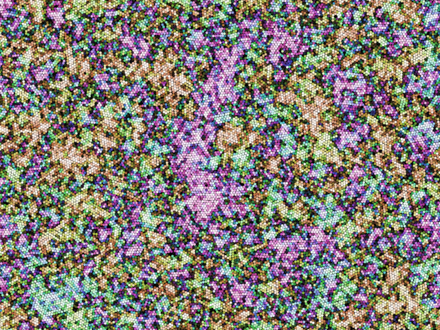

Circle packing! 

I have 160,000 hard disks (overlapping not allowed). If these are sampled
via equipartition (every valid state is equally likely), then there's a famous
phase transition that occurs. Instead of temperature, we have the packing fraction eta. For a close-packed arrangement eta0=pi\*sqrt(3)/6 ~= 0.9, for a square
lattice packing eta=pi/4~=0.79, and as you lower eta you go from long-range order to disorder. Actually, this phase transition happens somewhere around eta=0.66(cf Alder and Wainwright 1962, Phase Transition in Elastic Disks. They talk in terms of A/A0~=1.33 which is equal to eta0/eta in my notation.) 

For plotting, I use a method which I swear I saw in a Coursera course by 
Werner Krauth, but I haven't been able to find it again! Basically if you have a hexagonal close-packed lattice, you can rotate it by some angle $\theta\in [0,2\pi/6)$. It would be nice to have a way to get this theta for some nearly
close-packed cluster of points, and then if we colored by this theta we should
be able to see clusters with long-range order being approximately the same color. In the hexagonal close packing case, given some point $i$ at location $z_i$ treated as a complex number, we 
perform the sum over the closest neighbors: $\sum_j ((z_j-z_i)/(2r))^6$. This is guaranteed to be equal to $6e^{i\theta}$ (in the closest packing case). 
So I messed around with sums like this until I got a decent color function.

My C++ code is Bad with a capital B today, and I didn't get as far as writing command line arguments and all that. But OK, first I'll do it poorly, then I'll do it well :)

#### JAN. 02: No palettes. Generative colors, procedural colors, emergent colors.
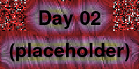

#### JAN. 03: [Droste effect](https://en.wikipedia.org/wiki/Droste_effect)
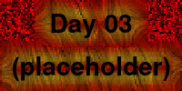

#### JAN. 04: Pixels
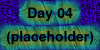

#### JAN. 05: In the style of [Vera Molnár](https://en.wikipedia.org/wiki/Vera_Moln%C3%A1r)

#### JAN. 06: Screensaver

#### JAN. 07: Progress bar / indicator / loading animation
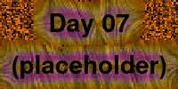

#### JAN. 08: Chaotic system
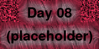

#### JAN. 09: ASCII
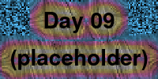

#### JAN. 10: Hexagonal

#### JAN. 11: In the style of [Anni Albers](https://en.wikipedia.org/wiki/Anni_Albers)

#### JAN. 12: Lava lamp
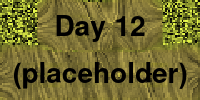

#### JAN. 13: Wobbly function day
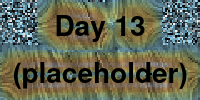

#### JAN. 14: Less than 1KB artwork
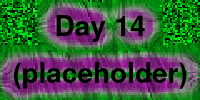

#### JAN. 15: Use a physics library
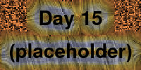

#### JAN. 16: Draw 10 000 of something
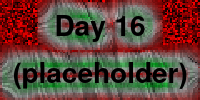

#### JAN. 17: Inspired by Islamic art
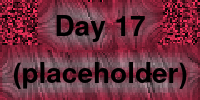

#### JAN. 18: [Bauhaus](https://en.wikipedia.org/wiki/Bauhaus)
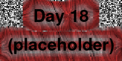

#### JAN. 19: Flocking

#### JAN. 20: Generative typography
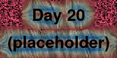

#### JAN. 21: Use a library that you haven't used before
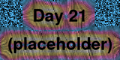

#### JAN. 22: Point - line - plane
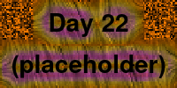

#### JAN. 23: 128\*128

#### JAN. 24: Impossible objects (undecided geometry)
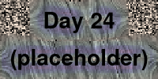

#### JAN. 25: "I should try to recreate this with code". Today is the day.

#### JAN. 26: Grow a seed.
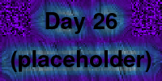

#### JAN. 27: Code for one hour. At the one hour mark, you're done.
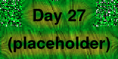

#### JAN. 28: Skeuomorphism. "Skeumorphs employ elements that, while essential to the original object, serve no pragmatic purpose in the new system."
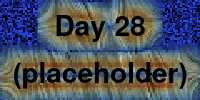

#### JAN. 29: Signed Distance Functions
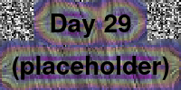

#### JAN. 30: Shaders

#### JAN. 31: Generative music / Generative audio / Generative sound.

