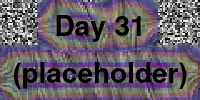

# David's Genuary 2024
> GENUARY is an artificially generated month of time where we build code that makes beautiful things. 

## David's Constraints
- Laptop dev environment: Each program has to run on an external server from a laptop.
- Configurability: Each program has to take CLI arguments with a large input parameter space.
- Documentation: Each argument needs a description and sensible error handling.
- Searchability: Each program has to be written with searchability in mind. 

By "searchability" think Wolfram rule 30; you create an algorithm that can be run on 256 possible rules, then plot them all and pick out the most interesting ones. This can be as simple as a "--quick" flag.

## Other modifiers
- [ ] Render using Blender's renderer
- [ ] Render using Mitsuba 3
- [ ] Incorporate charm.sh
- [ ] Create a Docker image of a project and run it on a hosting service
- [ ] Incorporate CUDA
- [ ] Write a program which saves from or loads to OpenVDB
- [ ] Postprocess a video using ffmpeg filters
- [ ] Use >32gb of memory (either RAM + hard drive or RAM)
- [ ] Use >10gb of vram
- [ ] Try to get the highest quality .gif output that Twitter will allow.
- [ ] Render a limit set (if your image is 640x480, make it so that turning the quality of your Simulation/generation up does not change the output at all)
- [ ] Chain two or more days' code together into a new project 
- [ ] Incorporate an LLM feedback mechanism
- [ ] Incorporate sound on a different day than Jan 31
- [ ] Publish a day as an interactive applet
- [ ] Incorporate automatic differentiation

# Days

#### JAN. 01: Particles, lots of them.

Circle packing! More specifically, the [hard disk model](http://www.sklogwiki.org/SklogWiki/index.php/Hard_disk_model).

I have 160,000 hard disks (overlapping not allowed). If these are sampled
via equipartition (every valid state is equally likely), then there's a famous
phase transition that occurs. Instead of temperature, we have the packing fraction eta. For a close-packed arrangement 
$\eta_0=\pi\sqrt{3}/6\approx 0.9$, for a square
lattice packing $\eta=\pi/4\approx 0.79$, and as you lower eta you go from long-range order to disorder. Actually, there's
a really rich structure of phases which is described in [this paper by Bernard and Krauth (2011)](https://arxiv.org/abs/1102.4094) but which I wouldn't do justice here. Interesting stuff happens for $0.7<\eta<0.72$ and above this you get hexagonal close packing -ish structure.

For plotting, I essentially used the method in the Bernard and Krauth paper, finding $\Psi_j$. Basically if you have a hexagonal close-packed lattice, you can rotate it by some angle $\theta\in [0,2\pi/6)$. 
Represent a particle's position as a complex number $z_i$. Then in the closest packed arrangement,
$e^{6\theta}=\frac{1}{6}\sum_j ((z_j-z_i)/(2r))^6$, where the sum is taken over the six neighboring particles of $z_i$.
Basically, you can mess with functions like that summation in order to get at theta, which will give a constant color to
regions of particles which are all "in the same lattice".

My C++ code is Bad with a capital B today, and I didn't get as far as writing command line arguments and all that. But OK, first I'll do it poorly, then I'll do it well :)

I'm leaving the code as-is for now, though I have to go back and make sure it satisfies the constraints I've set for myself.

#### JAN. 02: No palettes. Generative colors, procedural colors, emergent colors.

#### JAN. 03: [Droste effect](https://en.wikipedia.org/wiki/Droste_effect)

#### JAN. 04: Pixels

#### JAN. 05: In the style of [Vera Molnár](https://en.wikipedia.org/wiki/Vera_Moln%C3%A1r)

#### JAN. 06: Screensaver

#### JAN. 07: Progress bar / indicator / loading animation

#### JAN. 08: Chaotic system

#### JAN. 09: ASCII

#### JAN. 10: Hexagonal

#### JAN. 11: In the style of [Anni Albers](https://en.wikipedia.org/wiki/Anni_Albers)

#### JAN. 12: Lava lamp

#### JAN. 13: Wobbly function day

#### JAN. 14: Less than 1KB artwork

#### JAN. 15: Use a physics library

#### JAN. 16: Draw 10 000 of something

#### JAN. 17: Inspired by Islamic art

#### JAN. 18: [Bauhaus](https://en.wikipedia.org/wiki/Bauhaus)

#### JAN. 19: Flocking

#### JAN. 20: Generative typography

#### JAN. 21: Use a library that you haven't used before

#### JAN. 22: Point - line - plane

#### JAN. 23: 128\*128

#### JAN. 24: Impossible objects (undecided geometry)

#### JAN. 25: "I should try to recreate this with code". Today is the day.

#### JAN. 26: Grow a seed.

#### JAN. 27: Code for one hour. At the one hour mark, you're done.

#### JAN. 28: Skeuomorphism. "Skeumorphs employ elements that, while essential to the original object, serve no pragmatic purpose in the new system."

#### JAN. 29: Signed Distance Functions

#### JAN. 30: Shaders

#### JAN. 31: Generative music / Generative audio / Generative sound.

